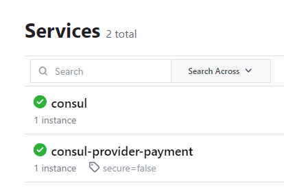

## 下载

https://developer.hashicorp.com/consul/downloads

下载windows版，注意别下成ARM架构的

解压之后直接在路径上cmd

```
consul --version
查看版本号
```


## 启动consul

```
consul agent -dev
```


## 进入Consul

```
http://localhost:8500
```


## Pay8006

### 导包

```xml
<dependencies>
    <dependency>
        <groupId>org.springframework.boot</groupId>
        <artifactId>spring-boot-starter-web</artifactId>
    </dependency>
    <dependency>
        <groupId>com.cloud</groupId>
        <artifactId>Commons</artifactId>
        <version>1.0-SNAPSHOT</version>
    </dependency>
    <dependency>
        <groupId>org.springframework.boot</groupId>
        <artifactId>spring-boot-devtools</artifactId>
    </dependency>
    <dependency>
        <groupId>org.projectlombok</groupId>
        <artifactId>lombok</artifactId>
    </dependency>

    <dependency>
        <groupId>org.springframework.cloud</groupId>
        <artifactId>spring-cloud-starter-consul-discovery</artifactId>
        <version>2.2.2.RELEASE</version>
    </dependency>
</dependencies>
```

### yml

```yml
server:
  port: 8006

spring:
  application:
    name: consul-provider-payment
  cloud:
    consul:
      host: localhost
      port: 8500
      discovery:
        service-name: ${spring.application.name}
        heartbeat:
          enabled: true
```


### controller

```java
@RestController
@Slf4j
public class PaymentController {

    @Value("${server.port}")
    private String serverPort;

    @RequestMapping("/payment/consul")
    public String paymentConsul() {
        return "SpringCloud with consul: " + serverPort + "\t" + UUID.randomUUID().toString();
    }

}
```

这样我们在Conusl就可以看到注册进去了




## 另外的orderConsul80我就不写了，和之前的zookeeper，Eureka是一样样的

