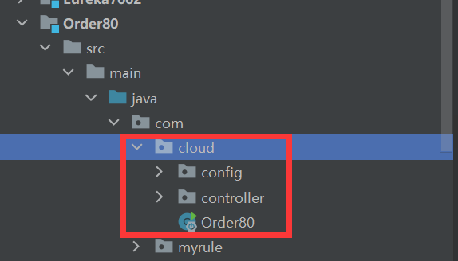

## 引包

```xml
<dependency>
	<groupId>org.springframework.cloud</groupId>
	<artifactId>spring-cloud-starter-netflix-ribbon</artifactId>
</dependency>
```

如果用Eureka的话，就不用引，因为已经引过了


## Ribbon负载均衡的实现

|           名称            |                             解释                             |
| :-----------------------: | :----------------------------------------------------------: |
|    RoundRobinRule轮询     |                   你一下我一下，轮流去访问                   |
|      RandomRule随机       |                             随机                             |
|         RetryRule         |     如果服务获取失败，则会在规定时间内重试，还不行就放弃     |
| WeightedResponseTimeRule  | 根据平均响应时间计算权重，时间越快权重越高，如果服务刚启动，先使用轮询，然后再切换到该策略 |
|     BestAvailableRule     |          先过滤掉宕机服务器，选一个并发量小的服务器          |
| AvailabilityFilteringRule | 先过滤掉宕机服务器，还有并发连接数超过阈值的服务器，然后对剩余服务器做轮询选取 |
|     ZoneAvoidanceRule     | 默认规则，复合判断server所在区域的性能和server的可用性选择服务器 |


## 修改策略

我们需要在不包含@ComponentScan注解范围下创建一个类



像上图，由于驱动类Order80有@SpringBootApplication注解，该注解包含了@ComponentScan，因此我们要在com包下创建一个新的文件夹，我这里命名为myrule，在myrule文件夹下创建一个新的类，MySelfRyle

```java
@Configuration
public class MySelfRule {

    // 将随机策略注入进Spring
    @Bean
    public IRule myRule() {
        return new RandomRule();
    }

}
```

我们将整个随机的策略放到Spring中，然后去修改驱动类上的注解

```java
@SpringBootApplication
@EnableEurekaClient
@RibbonClient(name = "CLOUD-PAYMENT-SERVICE", configuration = MySelfRule.class)
public class Order80 {

    public static void main(String[] args) {
        SpringApplication.run(Order80.class, args);
    }

}
```

告诉Springboot，在哪个集群，用的策略规则类是哪个

我们依次启动

Eureka集群【7001,7002】

服务集群【8001,8002】

客户端【80】

访问http://localhost/consumer/payment/getPaymentById/31

我们会发现，变成随机了