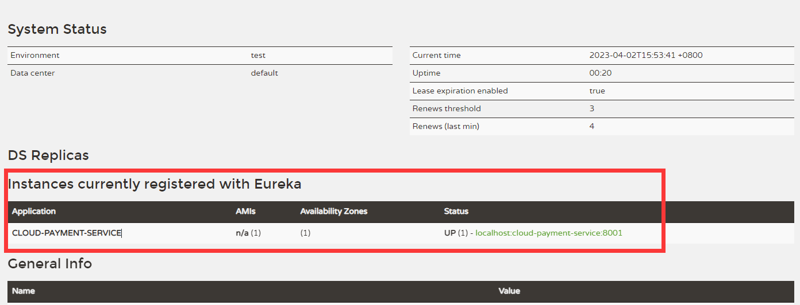

## 注册中心

porn.xml

```xml 
<dependencies>
    <dependency>
        <groupId>com.cloud</groupId>
        <artifactId>Commons</artifactId>
        <version>1.0-SNAPSHOT</version>
    </dependency>
    <dependency>
        <groupId>org.springframework.cloud</groupId>
        <artifactId>spring-cloud-starter-netflix-eureka-server</artifactId>
    </dependency>
    <dependency>
        <groupId>org.springframework.boot</groupId>
        <artifactId>spring-boot-starter-web</artifactId>
    </dependency>
    <!--监控-->
    <dependency>
        <groupId>org.springframework.boot</groupId>
        <artifactId>spring-boot-starter-actuator</artifactId>
    </dependency>
    <!-- 一般通用配置 -->
    <dependency>
        <groupId>org.springframework.boot</groupId>
        <artifactId>spring-boot-devtools</artifactId>
        <scope>runtime</scope>
        <optional>true</optional>
    </dependency>
    <dependency>
        <groupId>org.projectlombok</groupId>
        <artifactId>lombok</artifactId>
        <optional>true</optional>
    </dependency>
    <dependency>
        <groupId>org.springframework.boot</groupId>
        <artifactId>spring-boot-starter-test</artifactId>
        <scope>test</scope>
    </dependency>
</dependencies>
```

application.yml

```yml
server:
  port: 7001

eureka:
  instance:
    hostname: localhost # eureka服务端的实例名称
  client:
    register-with-eureka: false # 不往注册中心注册自己
    fetch-registry: false # 表示自己就是注册中心
    service-url:
      # 设置Eureka server交互地址查询服务和注册服务都需要依赖这个地址
      defaultZone: http://${eureka.instance.hostname}:${server.port}/eureka/
```

main

```java
@SpringBootApplication
@EnableEurekaServer // 表示是个注册中心
public class EurekaMain7001 {
    public static void main(String[] args) {
        SpringApplication.run(EurekaMain7001.class, args);
    }
}
```


## 其他服务需要注册到Eureka

porn.xml

```xml
<dependency>
    <groupId>org.springframework.cloud</groupId>
    <artifactId>spring-cloud-starter-netflix-eureka-client</artifactId>
</dependency>
```

application.yml

```yml
spring:
  application:
    name: cloud-payment-service # 微服务的名称
    
eureka:
  client:
    register-with-eureka: true # 表示注册进Eureka
    fetch-registry: true #是否从Eureka抓取已有信息，默认为true，集群必须true，才能配合Ribbon使用负载均衡
    service-url:
      defaultZone: http://localhost:7001/eureka # 写Eureka的地址

```

main

```java
@SpringBootApplication
@EnableEurekaClient // 加上这个注解
public class PaymentApplication {
    public static void main(String[] args) {
        SpringApplication.run(PaymentApplication.class, args);
    }
}
```

