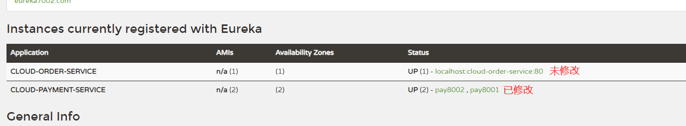

## 介绍

我们使用Eureka的时候，会碰到暴露主机名的信息


## 修改yml

我这里修改了8001和8002

```yml
eureka:
  instance:
    instance-id: pay8002
```




## 健康检查

http://localhost:8001/actuator/health

```json
{
status: "UP"
}
```


## 显示ip

```yml
instance:
  instance-id: pay8002
  prefer-ip-address: true # 显示其IP地址
```

这样我们显示的就不是localhost了，而是ip

```
http://192.168.116.1:8002/actuator/info
```

